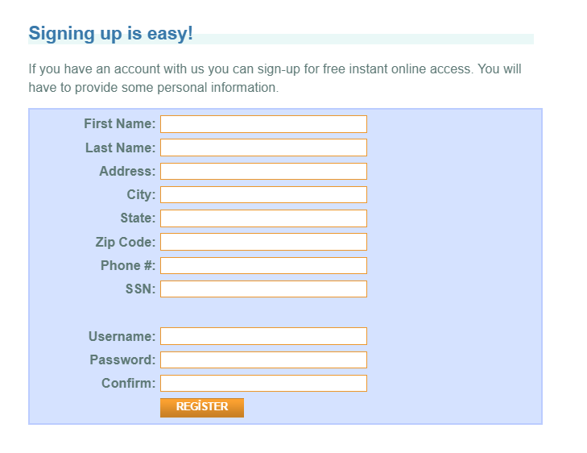
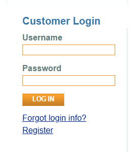
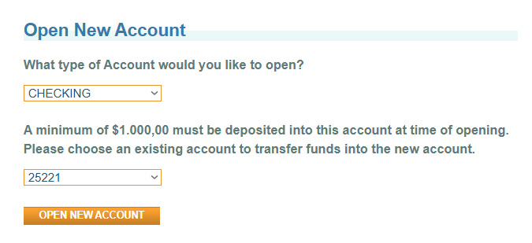
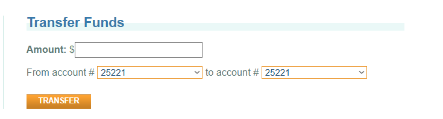
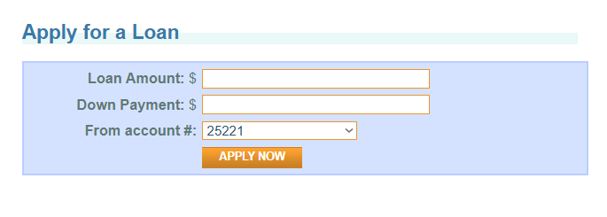

# 🏦 ParaBank Test Automation Suite

This repository contains an end-to-end test automation framework for the **ParaBank** web application. The project verifies key user flows including registration, login, bill payment, fund transfers, loan applications, and profile updates using a scalable and maintainable structure.

---

## 💡 Main Concept

This project aims to simulate a real-world **banking system** and test its most essential features through automated UI testing.

The framework is built with:
- **Selenium** for web automation.
- **Behavior Driven Development (BDD)** using **Cucumber**
- **Page Object Model (POM)** for modular, reusable code
- **JavaFaker (DataFaker)** to dynamically generate realistic user and billing data
- **Config Properties** to securely store environment settings (base URL, credentials, etc.)

This structure ensures clarity, flexibility, and data independence during test execution.

---

## 🛠 Tech Stack

| Category        | Tool/Library         |
|----------------|-----------------------|
| Programming    | Java                 |
| Automation     | Selenium WebDriver   |
| Framework      | TestNG + Cucumber (BDD) |
| Design Pattern | Page Object Model (POM) |
| Build Tool     | Maven                |
| Logging        | SLF4J + Log4j        |
| Reporting      | ExtentReports        |
| Data Generation| JavaFaker (DataFaker) |
| Config         | `config.properties`  |
| Version Control| Git & GitHub         |
| Test Management| Jira |

---

## 📁 Project Structure

```
src
├── main
│   └── java
│       ├── pages/           # Page Object Model classes
│       ├── utilities/       # Config reader, logger, base driver, etc.
├── test
│   └── java
│       ├── stepdefinitions/ # Cucumber step definitions
│       ├── runners/         # TestNG/Cucumber runners
│       └── features/        # Gherkin .feature files
```

---

## 📖 User Stories (Detailed)

### 🧾 US601 – User Registration
- Register with all required fields
- Get confirmation of successful account creation
- 🔄 Uses **DataFaker** to generate unique values
- 🔐 Secure credentials/configs from `config.properties`
- 

---

### 🔐 US602 – Login (Valid & Invalid)
- Login using valid credentials
- Verify error message on invalid login
- 🔐 Username/password handled via `config.properties`
- 

---

### 💸 US603 – Bill Payment
- Pay different bills: electricity, water, gas
- Confirm balance deduction and transaction history
- 🔄 DataFaker generates dynamic customer and payment info
- 

---

### 🏦 US604 – Open New Account
- Open Checking or Savings accounts
- Validate creation with correct account number
- 

---

### 🔁 US605 – Fund Transfer Between Accounts
- Transfer funds internally between user’s accounts
- Verify amount, source, and destination after operation
- 

---

### 📝 US606 – Update Contact Information
- Update profile fields: name, address, phone, etc.
- Validate saved changes and handle invalid data
- 

---

### 🧾 US607 – Loan Application
- Apply for a loan with specific amount and down payment
- See immediate result: approved or denied
- View new loan account if approved
- 

---

## ⚙️ Configuration

All runtime values like credentials, base URL, and browser type are stored securely in:

```
/src/test/resources/config.properties
```

Example:
```properties
baseUrl=https://parabank.parasoft.com
browser=chrome
username=testuser
password=testpass
```

---

#
## 📊 Reporting & Logs

- **ExtentReports** are generated under `/target/extent-reports/`
- **Log4j Logs** saved under `/logs/` directory
- Screenshots on failure available in `/screenshots/`

---

## 🔐 Security & Best Practices

- ✅ No hardcoded credentials or test data
- ✅ Dynamic test data generation with `DataFaker`
- ✅ Scalable and readable test architecture
- ✅ Reusable functions and POM design
- ✅ Gherkin-based scenarios for stakeholder readability

---

## 🤝 Contributing

You’re welcome to fork, open issues, or submit PRs.  
Please follow clean code principles and keep features modular.


# 👨‍💻 QA Team

| İsim           | GitHub Profili                                      |
|----------------|------------------------------------------------------|
| Merve Kıtır     | [github.com/mervektr](https://github.com/mervektr)         |
| Mert Saraç      | [github.com/meertsarac](https://github.com/meertsarac)     |
| Barış Sancar    | [github.com/brssncr](https://github.com/brssncr)           |
| Tolga Aktaş     | [github.com/aktstlga](https://github.com/aktstlga)         |
| Mert Canat      | [github.com/MertCanat91](https://github.com/MertCanat91)   |
| Berk Gültekin   | [github.com/berkgltkn](https://github.com/berkgltkn)       |


> This project is part of an automation framework designed for QA/SDET training and portfolio development.
